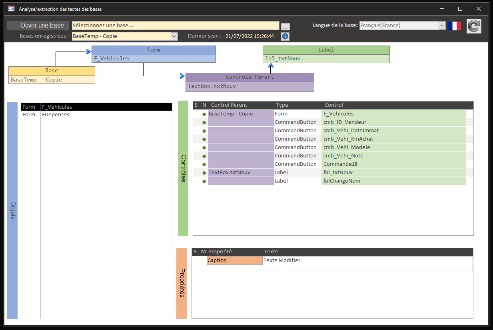
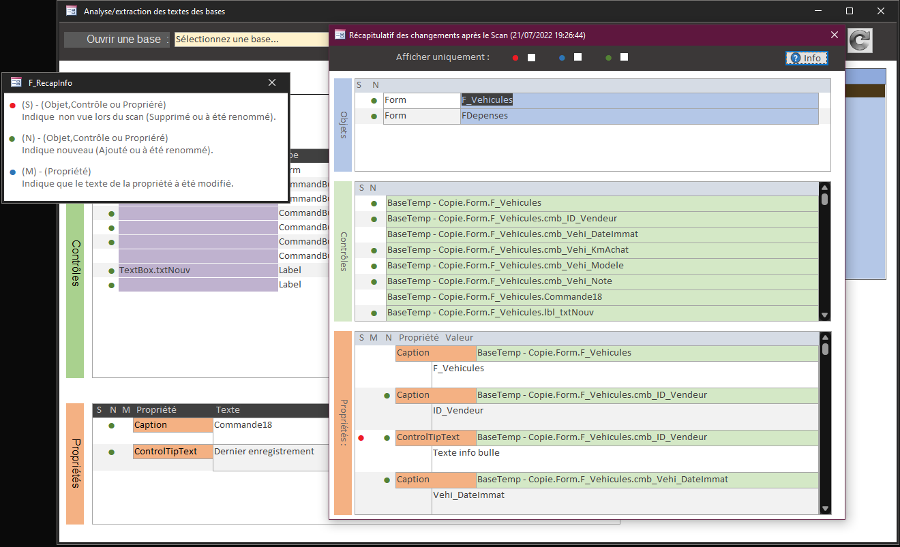
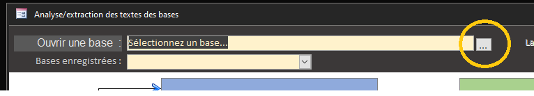
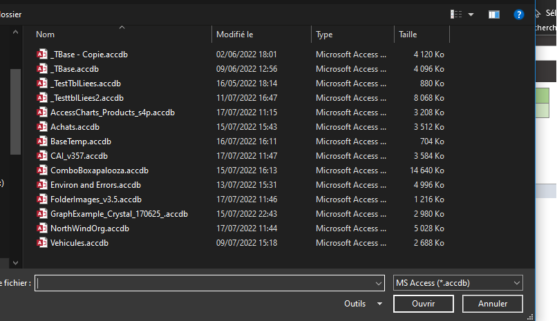
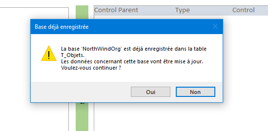
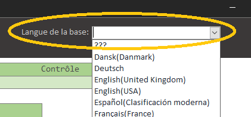
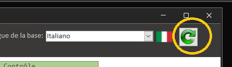
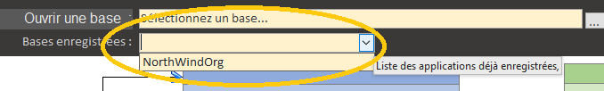

## 01/08/2022 - Arrêt du développement avec l'utilisation de la propriété `Tag`, car beaucoup trop aléatoire et aucun contrôle sur cette propriété qui peut être modifiée/dupliquée sans aucun contrôle de l'application MsTradAccess.

une nouvelle version est en cours...

# MSAccessTrad

Beta Test [v0.42-1](https://github.com/meuslaur/MSAccess-Trad/tree/beta) traduction Access

# Formulaire F_Main

# Utilisation :

- Ouvrir le formulaire `F_Main`

## Scan d’une nouvelle base :

- Sélectionnez une base

    

- choisir la nouvelle base à scanner :

    

- Si la base à déjà été scannée, une confirmation est demandée :

    

    - Si vous répondez OUI :

		- Les textes seront mis à jour
		- Les nouveaux textes à traduire seront ajouter
		- Le champ  `DateMaJ` de la table `T_TradTexte` est mis à jour pour chaque texte modifié / ajouté.
		- Pour les textes supprimés (contrôle supprimé ou renommé)

			- Le champ `DateMaJ` de la table `T_TradTexte` ne serait pas mis à jour, 
            ce qui permet de rapidement les sélectionnées
			- Une procédure seras prévu par la suite pour automatiser cela.

- Indiquer la langue d’origine de la base

    
    
	Ce choix ne pourra plus être modifier une fois la base scannée et ses textes enregistrés dans les tables.

- Lancer le scan avec le bouton suivant

# Ouvrir une base déjà scannée :
- Sélectionnez la base dans la liste :

## Résumé

|   Créer le|   2022/06/271|
| - | - |
|   Auteur| [@meuslau](https://github.com/meuslaur)|
|   Catégorie|   MsAccess|
|   Type|   Utilitaire|
|   Langage|   VBA|

### Code exporté avec l'outil de : [@joyfullservice](https://github.com/joyfullservice) - [msaccess-vcs-integration](https://github.com/joyfullservice/msaccess-vcs-integration)

- Créez une base vide et utilisez `msaccess-vcs-integration` pour réimporter le code.
