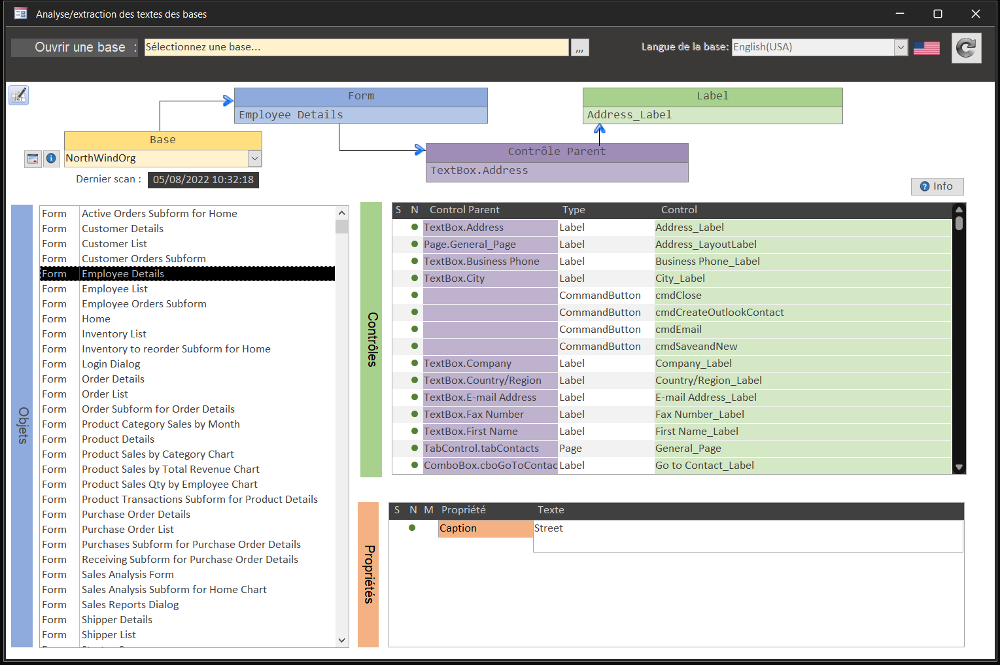

# MSAccessTrad

Beta Test [v0.40](https://github.com/meuslaur/MSAccess-Trad/tree/beta) traduction Access

## Formulaire de création

## Résumé

|   Créer le|   2022/06/271|
| - | - |
|   Auteur| [@meuslau](https://github.com/meuslaur)|
|   Catégorie|   MsAccess|
|   Type|   Utilitaire|
|   Langage|   VBA|

### Code exporté avec l'outil de : [@joyfullservice](https://github.com/joyfullservice) - [msaccess-vcs-integration](https://github.com/joyfullservice/msaccess-vcs-integration)

- Créez une base vide et utilisez `msaccess-vcs-integration` pour réimporter le code.
